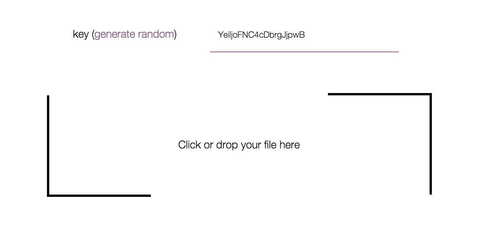

# FShare

Check it out, it's online: https://fshare.udtq.fr

FShare is (another) file sharing plateform, with the following specificities:
* It does not require any registration to drop a file.
* Files are stored encrypted on our server.
* It's open-source, so you can check what we do with your files.

## Using FShare (on https://fshare.udtq.fr/)

### Anonymous user
Anyone can drop a file on FShare without being registered. You just have to provide a key (if you want to)
and drop your file. It's that easy.



Anonymous users have the following limitations:
* size limit is 200MB per file,
* files are deleted after one download,
* files not downloaded are deleted after seven days.

Note that each of these parameters (size limit, number of downloads and number of days) are parameters of the 
application and are easily editable.


### Registered user
Registration allows to gain more freedom on your use of FShare. You can choose the number of downloads before deleting
the file (up to a maximum bound), or the expiration date of your file (also up to a maximum bound). You also have a higher 
size limit for each files.

We cannot give you more details about these bounds because it depends on the class of user you belong to. 
Every registration requires a registration key provided by the owner of the website (in this case, us). The key
corresponds to a certain class of restrictions that sets the bounds for your account. 

To get a registration key, send a request to fshare@udt.fr. The more we know you personally, the less restrictions
you'll have.

### CLI

For now, it returns the ID of the uploaded file:
```
$> curl -k -F "file[]=@test.txt" https://fshare.udtq.fr/upload
IujVKphI8goB
```

In this example, file is now available at `https://fshare.udtq.fr/dl/IujVKphI8goB`.

## Improvements to come

### Technical documentation
We aim to provide a "sub-technical" documentation of FShare, to give details about security and privacy mechanisms, 
permission management, anonymous users restrictions, etc.

### Installation pack
Even if files are stored encrypted, you still lose some control over your data. It is always better 
to store your own files on trusted computers. That is why we aim to provide a documentation to install
FShare on your own server, and in particular:

* how to configure NGinx, 
* how to manage permissions of the application on your server,
* how to set up the cron to automatically delete deprecated files, 
* etc. 

### Cipher file names (UP: Done!)
For now, even though file contents are encrypted, we still store files with the initial name in clear. 
In the future, we will improve privacy by encrypting file names too.

### Cipher files on client-side
Due to performance caring and technical specificities, the encryption of files is handled by 
the server. Even if the server does drop the key after this step, it is still a problem because it 
knows at some point both the file and the key. We are working on a client-side encryption and 
decryption to improve this point.

